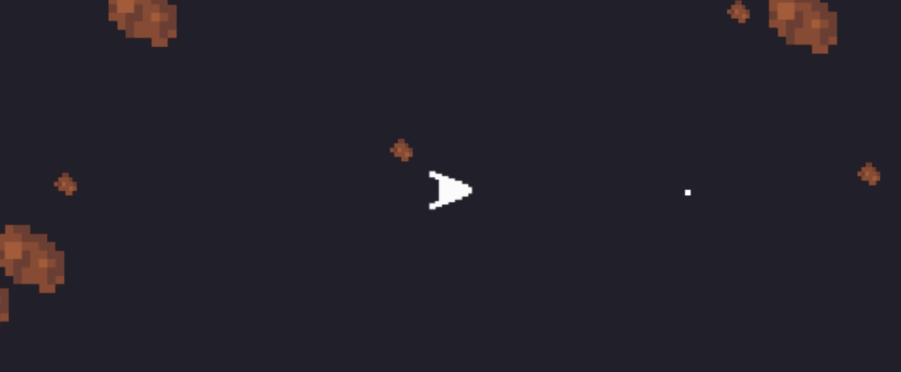

---
# Astro quest game

**Description:**
Astro Quest is an exciting space-themed game where players control a spaceship navigating through an asteroid field.

**How to Play:**
- Use the arrow keys to control the spaceship.
- Press the spacebar to fire bullets and destroy asteroids.
- Avoid colliding with asteroids.

**Technologies Used:**
- **Python:** The game is developed using the Python programming language.
- **Pygame:** Pygame library is used for creating the game graphics, handling user input, and managing game events.
- **Math Library:** The game utilizes mathematical calculations for spaceship movement, rotation, and collision detection.
- **Random Library:** Random library is used for generating random positions and sizes for asteroids.

**Game Features:**
- Dynamic spaceship movement and rotation.
- Realistic asteroid behavior with random generation.
- Responsive controls for an immersive gaming experience.
- Bullet shooting mechanism for destroying asteroids.
- Score tracking to monitor player progress.

**How to Run:**
1. Ensure you have Python and Pygame installed on your system.
2. Clone the repository from GitHub.
3. Navigate to the project directory in your terminal.
4. Run the game using the command: `python astro_quest.py`

**Credits:**
- Developed by Sutton.
- Artwork credits to Sutton for the spaceship and asteroids pixel art images.

**Contributing:**
Contributions are welcome! Feel free to submit bug reports, feature requests, or pull requests to help improve the game.

---
